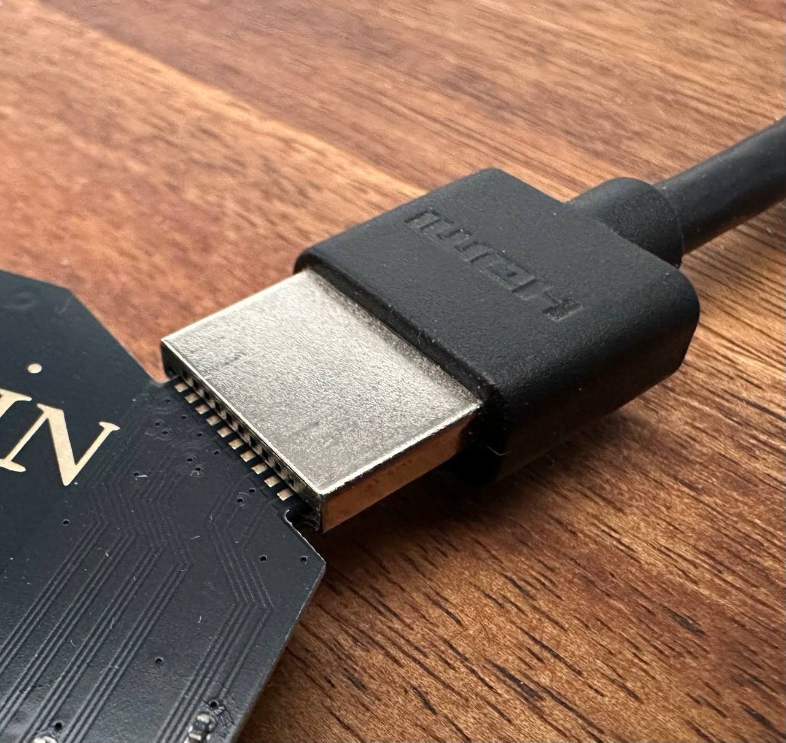

# Using the HDMIzness board

I'm pretty sure I'm the only perso in the world whose business card has an user manual. I must say,
I did not expect to be in that situation one day.

The card is just a tiny Linux computer with an HDMI output, and the user manual is not that complex.

## Software

When attaching the card to a computer, Linux will automatically boot. Once booted, the card will
present itself as an USB-Ethernet adapter. It exposes a DHCP server to automatically hand out an IP
address to your computer.

It exposes an web service to control the keyboard and mouse for DOOM.

It exposes an SSH server (root/root) to log into the card.

## Physical

### HDMI port

On the top-right of the card, you will find an HDMI port, that should be slotted inside of an HDMI
cable. It's a connector without the metal housing.

An HDMI connector has a wide part and a narrow part. The wide part should be on the main side of
the card (with the text and the components), while the narrow one should be on the bottom. Most
HDMI cables have the HDMI logo on what is considered the "top" of the connector, that is the wide
part.

_Note_: the card may be damaged if inserted upside down and not straight in the cable. It will not
be damaged if inserted properly even if the connection is not straight.

### USB port

On the bottom-left of the card, you will find an USB port, to plug the card in a computer for power
and interaction. If you don't trust me, a battery bank will do fine.

I would continue the decades-old meme of USB orientation, however it's pretty easy to put it the
right way: on a standard laptop, the card has to be inserted with the text upwards. Basically, if
you can read the lovely (/s) words on the card, it's good.

_Note_: the card will not be damaged by inserting the USB the wrong way around.

### LED

On the center of the card, you will find an RGB LED. The color indicates the stage in the boot
process.

- Red is the bootloader (U-Boot) loading
- Green/Blue is Linux loading
- White is Linux booting

### Button

There is one button, and it's the reboot button.
